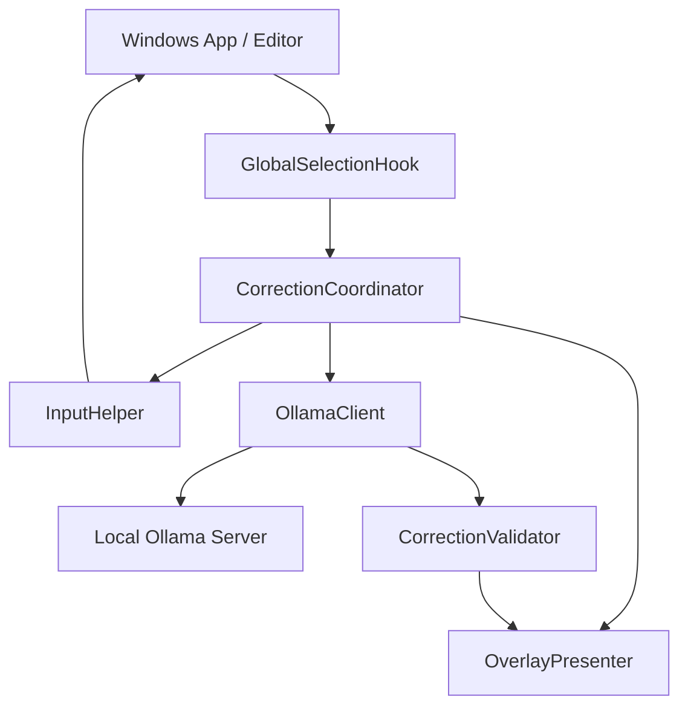
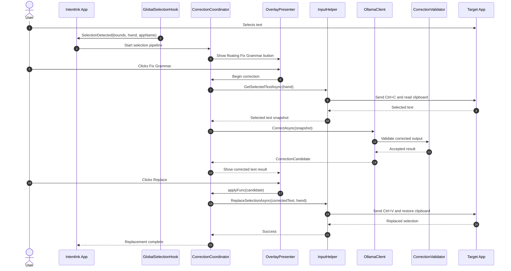

# IntentInk Architecture

IntentInk is a Windows-native, privacy-first grammar assistant that runs in the background while the user works in other applications.

The design is intentionally simple:
- detect selection events in the foreground app,
- show a low-profile overlay,
- capture the selected text,
- send it to a local Ollama model,
- and replace the selected text in place without stealing focus.

---

## Runtime model

IntentInk does not run as a normal app window with a persistent editing surface. Instead, it behaves like a tray-based background service:

1. Start once per user session.
2. Load the settings.
3. Install global hooks.
4. Wait for text selection events.
5. Show a floating suggestion only when the user selects text.
6. Run the correction pipeline and then go quiet again.

This keeps the experience fast, minimal, and non-disruptive.

---

## High-level component map



---

## Background startup sequence

The app entry point in [src/IntentInk.Desktop/App.xaml.cs](src/IntentInk.Desktop/App.xaml.cs) performs the startup flow:

```text
App startup
  -> single-instance mutex
  -> load SettingsStore
  -> create tray icon
  -> init OllamaClient
  -> init OverlayPresenter
  -> start CorrectionCoordinator
  -> install global low-level hooks
```

At this point the app is effectively idle but active in the background. It remains in the system tray until the user selects text or changes settings.

---

## Selection detection layer

The global selection detection is implemented in [src/IntentInk.Desktop/Interop/GlobalSelectionHook.cs](src/IntentInk.Desktop/Interop/GlobalSelectionHook.cs).

It listens to:
- `WH_MOUSE_LL` for drag and double-click selection,
- `WH_KEYBOARD_LL` for Shift+Arrow and Ctrl+A selection patterns,
- keyboard events that should dismiss the overlay during regular typing.

The reason this is important is that other approaches such as full UI automation or polling are fragile across apps. IntentInk instead reacts to the actual Windows selection state in the foreground window.

### Selection event chain

```
User selects text
  -> mouse / keyboard hook receives event
  -> target app and window handle are resolved
  -> selection is validated
  -> SelectionDetected(bounds, hwnd, appName) is raised
  -> CorrectionCoordinator opens the suggestion overlay
```

---

## Overlay and UI layer

IntentInk uses an overlay window rather than a normal app window so the action can appear close to the selection without taking focus from the user’s work.

The overlay is designed to be:
- non-activating,
- topmost,
- close to the selected text,
- lightweight and temporary,
- and dismissed when the user continues typing or changes selection.

The UI layer is controlled by the presenter and result cards; the main user interaction is a compact suggestion pill and a result panel.

---

## Correction coordinator

The central coordination logic lives in [src/IntentInk.Desktop/Services/CorrectionCoordinator.cs](src/IntentInk.Desktop/Services/CorrectionCoordinator.cs).

It is the orchestration hub for the full correction lifecycle:

1. Selection is received.
2. The overlay asks the user to fix the selection.
3. The selected text is copied using safe clipboard capture.
4. The text is sent to the local AI client.
5. The result is validated.
6. If approved, the app applies the corrected text in place.

The coordinator is also responsible for preserving the user’s clipboard and preventing overlapping replacement operations through a semaphore.

---

## Input and replacement layer

The replacement logic is in [src/IntentInk.Desktop/Interop/InputHelper.cs](src/IntentInk.Desktop/Interop/InputHelper.cs).

This component wraps the Windows copy/paste interaction:
- it snapshots the current clipboard,
- ensures the target app is foreground,
- sends synthetic `Ctrl+C` to get the selected text,
- or sends `Ctrl+V` to insert the corrected text,
- then restores the clipboard to its original state.

This is the key to making the feature work across many Windows apps without writing a custom adapter for each one.

---

## AI and validator layer

The AI access is implemented in [src/IntentInk.Desktop/Infrastructure/OllamaClient.cs](src/IntentInk.Desktop/Infrastructure/OllamaClient.cs).

The architecture is intentionally local-only:
- the app calls a local Ollama server,
- it uses a strict structured JSON schema,
- the request includes a grammar-focused system prompt,
- and the result is validated before it is shown to the user.

The validator in [src/IntentInk.Core/Services/CorrectionValidator.cs](src/IntentInk.Core/Services/CorrectionValidator.cs) rejects changes that are too large, too noisy, or unsafe. This keeps the correction pipeline reliable even when the model produces unexpected text.

---

## End-to-end correction workflow



---

## Why this architecture works well

This is a background-first architecture, not a foreground editor architecture. That gives it several advantages:

- stays out of the way while the user works,
- works across common Windows editors and web apps,
- avoids a cloud dependency,
- avoids invasive access patterns,
- and preserves the user’s original clipboard state.

The correction pipeline is built around a single rule: the user selects text, IntentInk acts locally, and the replacement happens directly in the active app without breaking the user’s flow.

