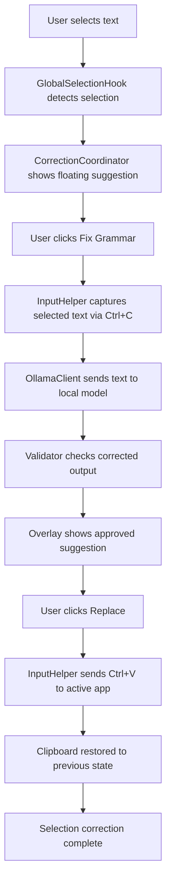

# Replacement and Background Correction Pipeline

This document explains how IntentInk turns a user’s text selection into a corrected result without breaking the user’s editing flow.

---

## Pipeline summary

```text
Selection event
  -> detect foreground app + selection bounds
  -> show floating fix pill
  -> capture selected text safely
  -> call local Ollama grammar model
  -> validate generated correction
  -> display result in overlay
  -> confirm replacement
  -> send Ctrl+V to target app
  -> restore clipboard
```

---

## 1. Detecting a selection in the background

The process begins in [src/IntentInk.Desktop/Interop/GlobalSelectionHook.cs](src/IntentInk.Desktop/Interop/GlobalSelectionHook.cs).

The app installs low-level hooks to observe mouse and keyboard actions across the system. These hooks are not acting as a text logger; they only detect when a selection is likely occurring and whether the user is continuing to type normally.

Key behaviors:
- drag selection triggers a detection event,
- double-click / triple-click word selection triggers a detection event,
- Shift+Arrow and Ctrl+A selection patterns trigger a detection event,
- ordinary typing clears the pill and prevents stale suggestions.

This is what allows IntentInk to work in the background without an explicit app integration per editor.

---

## 2. Showing the suggestion without stealing focus

Once a selection is detected, [src/IntentInk.Desktop/Services/CorrectionCoordinator.cs](src/IntentInk.Desktop/Services/CorrectionCoordinator.cs) tells the overlay to display a small floating button near the selection.

The overlay must be non-activating, because a normal pop-up would steal keyboard focus and instantly disrupt the user’s selection. The app avoids this by keeping the UI lightweight and topmost while using Win32 behaviors that do not activate the window.

This is one of the most important design decisions in the app: the target app remains the active editing surface, and IntentInk behaves like a helper layer rather than a focus-taking tool.

---

## 3. Capturing selected text safely

When the user clicks the suggestion action, the app copies the selected text from the active application using [src/IntentInk.Desktop/Interop/InputHelper.cs](src/IntentInk.Desktop/Interop/InputHelper.cs).

The process is:
1. ensure the target app is foreground,
2. snapshot the current clipboard,
3. clear the clipboard,
4. send `Ctrl+C`,
5. read the clipboard text,
6. restore the original clipboard afterward.

The clipboard is preserved in memory so the user’s previous copy content is not lost.

This works because most Windows text editors and browsers support the standard clipboard model, which is enough for a general-purpose helper without app-specific adapters.

---

## 4. Calling the local grammar model

After the text is captured, the coordinator sends it to [src/IntentInk.Desktop/Infrastructure/OllamaClient.cs](src/IntentInk.Desktop/Infrastructure/OllamaClient.cs).

The request is sent to the local Ollama endpoint and includes:
- the selected text,
- a grammar-focused system prompt,
- and a strict JSON schema for the response.

The JSON contract is intentionally narrow:

```json
{
  "corrected_text": "..."
}
```

This keeps parsing deterministic and minimizes accidental output formatting issues.

---

## 5. Validation before showing the result

The response is not accepted blindly. The validator in [src/IntentInk.Core/Services/CorrectionValidator.cs](src/IntentInk.Core/Services/CorrectionValidator.cs) checks:
- whether the text changed at all,
- whether the output is too large or too noisy,
- whether protected tokens were altered,
- and whether the edit pattern is unlikely to be a useful grammar correction.

If the model output is rejected, the user sees no risky replacement and the pipeline ends safely.

---

## 6. Applying the corrected text back into the document

Once the result is accepted, the user can replace the selection. The actual insertion is performed by the same clipboard-safe helper:

1. snapshot the current clipboard,
2. set the corrected text into the clipboard,
3. send `Ctrl+V`,
4. wait briefly for the target app to consume the paste,
5. restore the original clipboard state.

This means the user’s selected sentence is replaced in place rather than rewritten elsewhere or pasted into a separate editor.

---

## 7. Why the background pipeline is stable

The key stability properties are:
- no app-specific adapters are required for supported text editors,
- clipboard operations are transactional,
- replacement is guarded by a lock so two edits cannot overlap,
- the user’s typing flow is not interrupted by focus theft,
- the AI call happens locally and does not require a cloud account.

This is the core reason the app can work quietly in the background while the user is writing in normal Windows applications.

---

## Full lifecycle diagram



This is the actual correction loop that makes IntentInk feel like a natural background writing helper rather than an intrusive app window.
